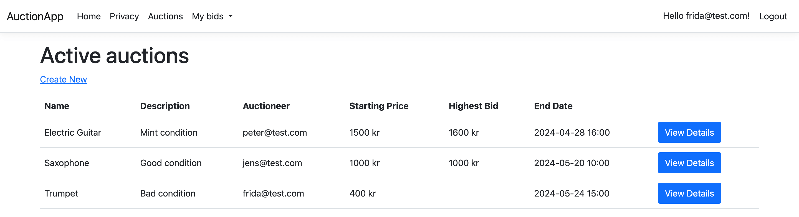
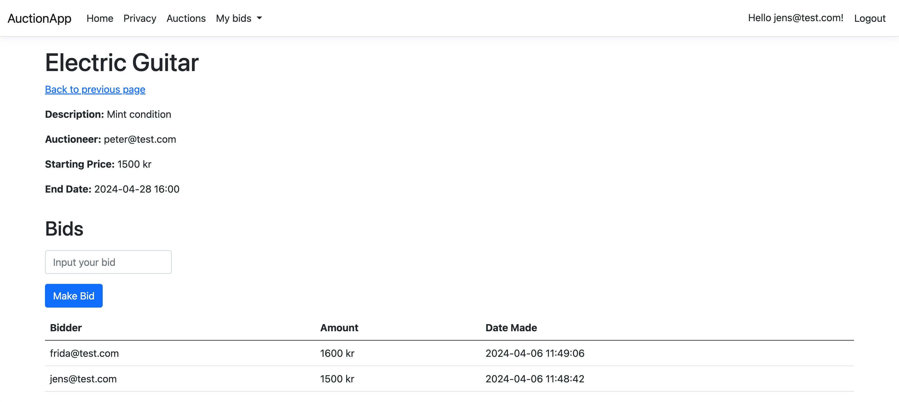
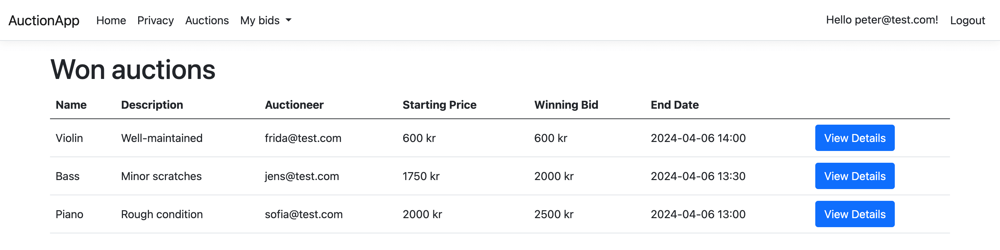

# Auction App

A simple auction web app developed using C#, ASP.NET MVC, Entity Framework (ORM), AutoMapper, and SQLite.

This project was part of a distributed information systems course at KTH.

